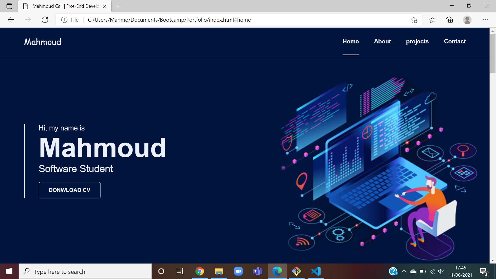
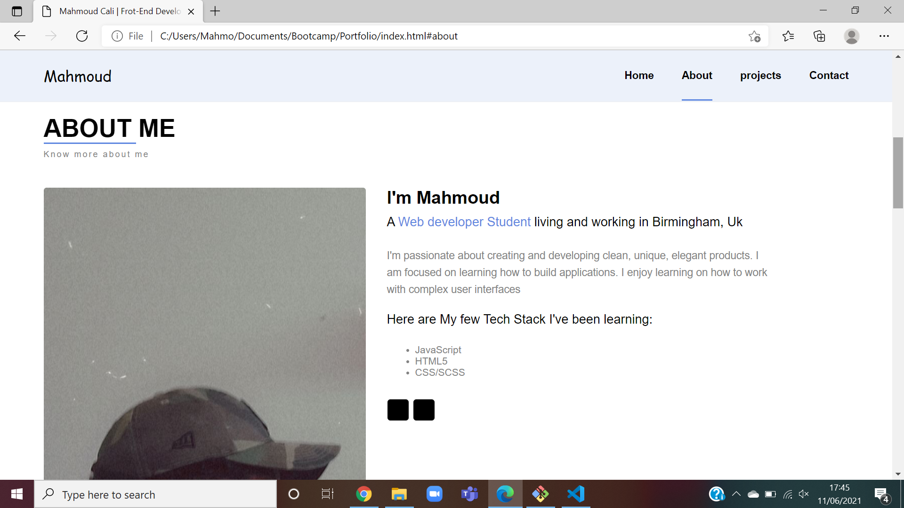
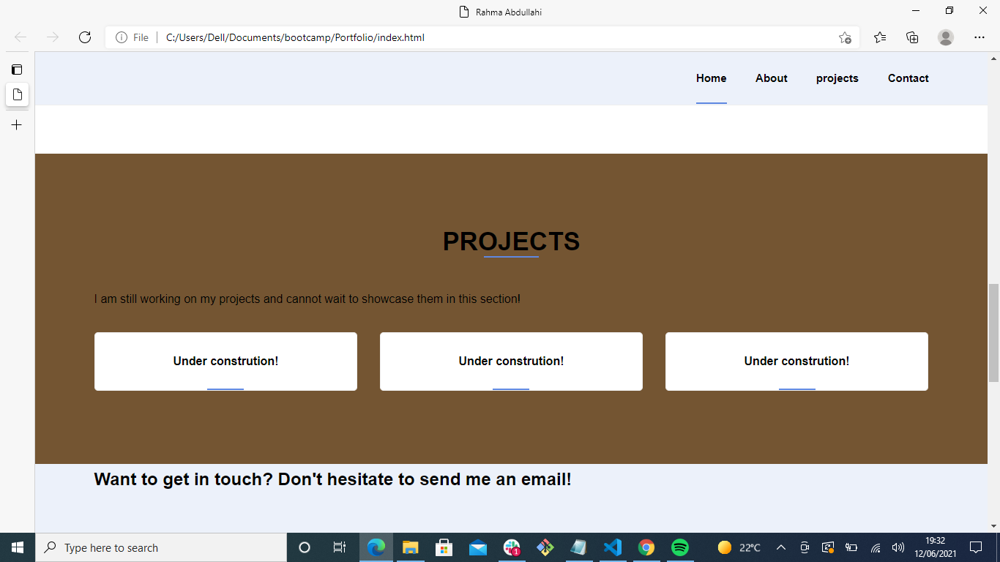
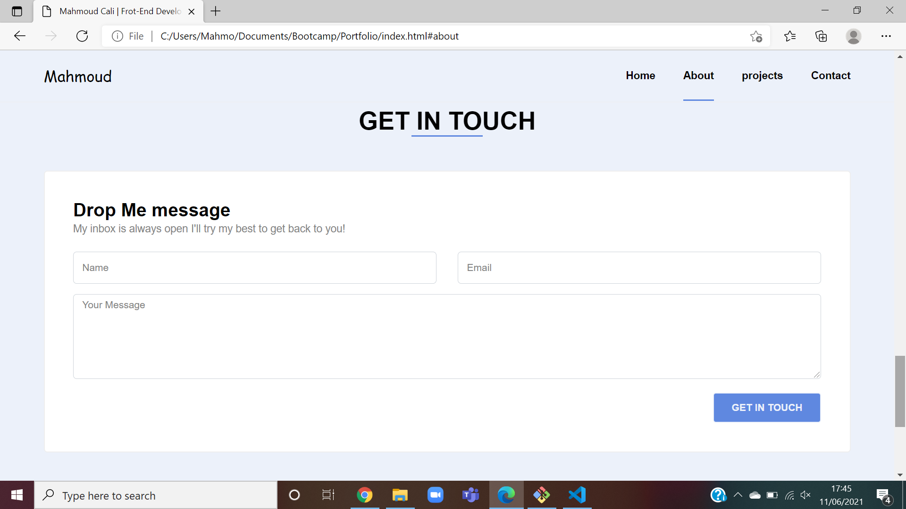

# Description
This is a 3 pages portfolio applicaion and it was created using HTML CSS and a bit of Javascript.

#### The 3 sections of thi application includes:
* Home page
* Portfolio
* Contact

## Utilization
The user may access the sidebar by clicking on the menu symbol in the application's upper right corner. The sidebar includes connections to the application's various parts.

Deployed Link:

## Screenshots 

## Refrences Used 
W3schools: https://www.w3schools.com/

Bootstrap: https://getbootstrap.com/

